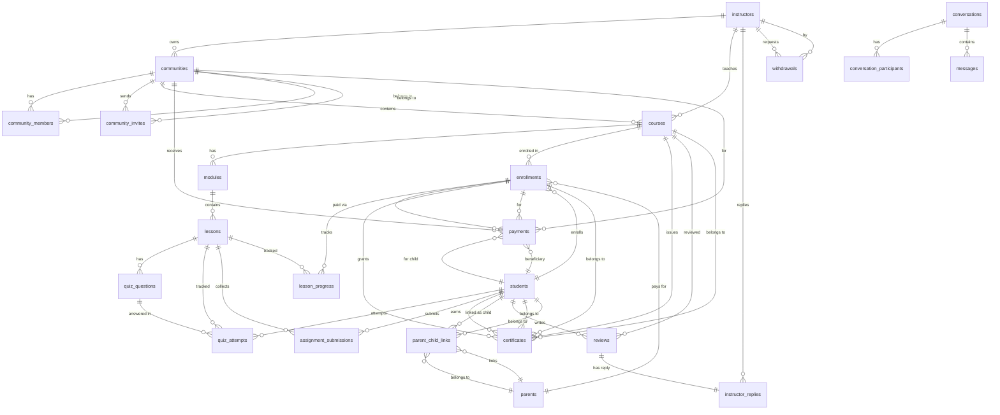

# Hive — Entity Relationship Diagram

> Generated from Drizzle ORM schema. All tables use `integer` surrogate keys (`GENERATED ALWAYS AS IDENTITY`).

---

## Shared Column Helpers

### `BaseUser` (spread into `instructors`, `students`, `parents`)

| Column | Type | Attributes |
|---|---|---|
| `id` | `integer` | PK, identity |
| `first_name` | `varchar(255)` | NOT NULL |
| `last_name` | `varchar(255)` | NOT NULL |
| `email` | `varchar(255)` | NOT NULL |
| `role` | `user_role` enum | NOT NULL |
| `email_verified` | `boolean` | DEFAULT false |
| `email_verified_at` | `timestamp` | |
| `last_login_at` | `timestamp` | |
| `avatar` | `varchar(500)` | |
| `bio` | `text` | |
| `phone` | `varchar(50)` | |
| `phone_verified` | `boolean` | DEFAULT false |
| `password_changed_at` | `timestamp` | |
| `onboarded` | `boolean` | DEFAULT false |
| `hash` | `varchar(255)` | Argon2id password hash |
| `preferences` | `jsonb` | Theme, locale, timezone, notifications |
| `created_at` | `timestamp` | NOT NULL, DEFAULT now() |
| `updated_at` | `timestamp` | NOT NULL, DEFAULT now(), auto-update |

### `timestamps`

| Column | Type | Attributes |
|---|---|---|
| `created_at` | `timestamp` | NOT NULL, DEFAULT now() |
| `updated_at` | `timestamp` | NOT NULL, DEFAULT now(), `$onUpdate` |

### `softDelete`

| Column | Type | Attributes |
|---|---|---|
| `deleted_at` | `timestamp` | |

---

## Enums

| Enum | Values |
|---|---|
| `user_role` | `instructor`, `student`, `parent` |
| `quiz_question_type` | *(from QuizQuestionType)* |
| `assignment_submission_status` | `pending`, `graded`, ... |
| `community_visibility` | `public`, `private`, ... |
| `community_member_role` | `owner`, `admin`, `moderator`, `member` |
| `community_member_status` | `active`, `inactive`, `banned`, ... |
| `community_invite_status` | `pending`, `accepted`, `expired`, ... |
| `course_difficulty` | `beginner`, `intermediate`, `advanced` |
| `course_visibility` | `public`, `private`, `unlisted` |
| `course_status` | `draft`, `published`, `archived` |
| `lesson_type` | `video`, `pdf`, `live`, `quiz`, `assignment` |
| `lesson_status` | `draft`, `published`, `archived` |
| `conversation_type` | `direct`, `group` |
| `message_type` | `text`, `image`, `file`, ... |
| `notification_type` | *(from NotificationType)* |
| `payment_status` | `pending`, `completed`, `failed`, `refunded` |
| `payment_type` | `enrollment`, `community`, ... |
| `payment_method` | `paystack`, ... |
| `withdrawal_status` | `pending`, `processing`, `completed`, `failed` |

---

## Models & Relations

### 1. Instructors

**Table:** `instructors`

Spreads `BaseUser` + `softDelete`.

| Extra Column | Type | Attributes |
|---|---|---|
| `specialization_tags` | `jsonb` → `string[]` | DEFAULT `[]` |

| Index / Constraint | Columns |
|---|---|
| `uq_instructors_email` (unique) | `email` |

**Drizzle Relations:**
```
instructors ──< communities       (has-many)
instructors ──< courses           (has-many)
instructors ──< instructorReplies (has-many)
instructors ──< withdrawals       (has-many)
```

---

### 2. Students

**Table:** `students`

Spreads `BaseUser` + `softDelete`.

| Extra Column | Type | Attributes |
|---|---|---|
| `interest_tags` | `jsonb` → `string[]` | DEFAULT `[]` |

| Index / Constraint | Columns |
|---|---|
| `uq_students_email` (unique) | `email` |

**Drizzle Relations:**
```
students ──< quizAttempts         (has-many)
students ──< assignmentSubmissions (has-many)
students ──< certificates         (has-many)
students ──< enrollments          (has-many)
students ──< parentChildLinks     (has-many, as child)
students ──< payments             (has-many, as beneficiary)
students ──< reviews              (has-many)
```

---

### 3. Parents

**Table:** `parents`

Spreads `BaseUser` + `softDelete`. No extra columns.

| Index / Constraint | Columns |
|---|---|
| `uq_parents_email` (unique) | `email` |

**Table:** `parent_child_links`

| Column | Type | Attributes |
|---|---|---|
| `id` | `integer` | PK, identity |
| `parent_id` | `integer` | FK → `parents.id`, CASCADE |
| `student_id` | `integer` | FK → `students.id`, CASCADE |
| `linked_at` | `timestamp` | NOT NULL, DEFAULT now() |
| `deleted_at` | `timestamp` | soft delete |

| Index / Constraint | Columns |
|---|---|
| `uq_parent_child_link` (unique) | `parent_id`, `student_id` |
| `idx_parent_child_parent` | `parent_id` |
| `idx_parent_child_student` | `student_id` |

**Drizzle Relations:**
```
parents      ──< parentChildLinks  (has-many)
parents      ──< enrollments       (has-many, as enrolledBy)
parentChildLinks >── parents        (belongs-to)
parentChildLinks >── students       (belongs-to)
```

---

### 4. Communities

**Table:** `communities`

| Column | Type | Attributes |
|---|---|---|
| `id` | `integer` | PK, identity |
| `owner_id` | `integer` | FK → `instructors.id`, RESTRICT |
| `name` | `varchar(255)` | NOT NULL |
| `slug` | `varchar(255)` | NOT NULL |
| `description` | `text` | |
| `category` | `varchar(255)` | |
| `visibility` | `community_visibility` enum | DEFAULT `public` |
| `requires_approval` | `boolean` | DEFAULT false |
| `is_paid` | `boolean` | DEFAULT false |
| `price` | `integer` | kobo, null if free |
| `cover_image_url` | `varchar(500)` | |
| `member_count` | `integer` | DEFAULT 0 |
| `course_count` | `integer` | DEFAULT 0 |
| `average_rating` | `integer` | 0–50, ÷10 for display |
| `review_count` | `integer` | DEFAULT 0 |
| `sequential_courses` | `boolean` | DEFAULT false |
| `allow_downloads` | `boolean` | DEFAULT true |
| `max_concurrent_devices` | `integer` | DEFAULT 3 |
| `grace_period_days` | `integer` | DEFAULT 0 |
| `created_at`, `updated_at` | `timestamp` | |
| `deleted_at` | `timestamp` | soft delete |

| Index / Constraint | Columns |
|---|---|
| `uq_communities_slug` (unique) | `slug` |
| `idx_communities_owner` | `owner_id` |
| `idx_communities_category` | `category` |
| `idx_communities_visibility` | `visibility` |

**Table:** `community_members` (polymorphic)

| Column | Type | Attributes |
|---|---|---|
| `id` | `integer` | PK, identity |
| `community_id` | `integer` | FK → `communities.id`, CASCADE |
| `entity_id` | `integer` | NOT NULL (polymorphic FK) |
| `entity_type` | `user_role` enum | NOT NULL |
| `role` | `community_member_role` enum | DEFAULT `member` |
| `status` | `community_member_status` enum | DEFAULT `active` |
| `joined_at` | `timestamp` | DEFAULT now() |
| `expires_at` | `timestamp` | |
| `created_at`, `updated_at` | `timestamp` | |

| Index / Constraint | Columns |
|---|---|
| `uq_community_member` (unique) | `community_id`, `entity_id`, `entity_type` |
| `idx_community_members_community` | `community_id` |
| `idx_community_members_entity` | `entity_id`, `entity_type` |
| `idx_community_members_status` | `status` |

**Table:** `community_invites`

| Column | Type | Attributes |
|---|---|---|
| `id` | `integer` | PK, identity |
| `community_id` | `integer` | FK → `communities.id`, CASCADE |
| `invited_by` | `integer` | NOT NULL (polymorphic FK) |
| `email` | `varchar(255)` | NOT NULL |
| `status` | `community_invite_status` enum | DEFAULT `pending` |
| `sent_at` | `timestamp` | DEFAULT now() |
| `accepted_at` | `timestamp` | |
| `created_at`, `updated_at` | `timestamp` | |

| Index / Constraint | Columns |
|---|---|
| `uq_community_invite` (unique) | `community_id`, `email` |
| `idx_community_invites_community` | `community_id` |
| `idx_community_invites_status` | `status` |

**Drizzle Relations:**
```
communities       >── instructors       (belongs-to, owner)
communities       ──< communityMembers  (has-many)
communities       ──< communityInvites  (has-many)
communities       ──< courses           (has-many)
communities       ──< payments          (has-many)
communityMembers  >── communities       (belongs-to)
communityInvites  >── communities       (belongs-to)
```

---

### 5. Courses

**Table:** `courses`

| Column | Type | Attributes |
|---|---|---|
| `id` | `integer` | PK, identity |
| `instructor_id` | `integer` | FK → `instructors.id`, RESTRICT |
| `community_id` | `integer` | FK → `communities.id`, RESTRICT |
| `title` | `varchar(255)` | NOT NULL |
| `slug` | `varchar(255)` | NOT NULL |
| `subtitle` | `varchar(500)` | |
| `description` | `text` | |
| `category` | `varchar(255)` | |
| `difficulty` | `course_difficulty` enum | DEFAULT `beginner` |
| `visibility` | `course_visibility` enum | DEFAULT `public` |
| `price` | `integer` | kobo, DEFAULT 0 |
| `is_free` | `boolean` | DEFAULT true |
| `monthly_price` | `integer` | kobo |
| `cover_image_url` | `varchar(500)` | |
| `sequential_access` | `boolean` | DEFAULT false |
| `drip_content` | `boolean` | DEFAULT false |
| `allow_comments` | `boolean` | DEFAULT true |
| `allow_downloads` | `boolean` | DEFAULT true |
| `offer_certificate` | `boolean` | DEFAULT false |
| `min_completion_percent` | `integer` | DEFAULT 80 |
| `min_quiz_score_percent` | `integer` | DEFAULT 70 |
| `min_attendance_percent` | `integer` | DEFAULT 60 |
| `status` | `course_status` enum | DEFAULT `draft` |
| `enrollment_count` | `integer` | DEFAULT 0 |
| `average_rating` | `integer` | 0–50, ÷10 for display |
| `review_count` | `integer` | DEFAULT 0 |
| `created_at`, `updated_at` | `timestamp` | |
| `deleted_at` | `timestamp` | soft delete |

| Index / Constraint | Columns |
|---|---|
| `uq_courses_slug` (unique) | `slug` |
| `idx_courses_instructor` | `instructor_id` |
| `idx_courses_community` | `community_id` |
| `idx_courses_status` | `status` |
| `idx_courses_category` | `category` |

**Table:** `modules`

| Column | Type | Attributes |
|---|---|---|
| `id` | `integer` | PK, identity |
| `course_id` | `integer` | FK → `courses.id`, CASCADE |
| `title` | `varchar(255)` | NOT NULL |
| `description` | `text` | |
| `sort_order` | `integer` | DEFAULT 0 |
| `created_at`, `updated_at` | `timestamp` | |

| Index / Constraint | Columns |
|---|---|
| `idx_modules_course` | `course_id` |

**Table:** `lessons`

| Column | Type | Attributes |
|---|---|---|
| `id` | `integer` | PK, identity |
| `module_id` | `integer` | FK → `modules.id`, CASCADE |
| `title` | `varchar(255)` | NOT NULL |
| `description` | `text` | |
| `type` | `lesson_type` enum | DEFAULT `video` |
| `duration` | `varchar(100)` | human-readable e.g. "12:30" |
| `sort_order` | `integer` | DEFAULT 0 |
| `free_preview` | `boolean` | DEFAULT false |
| `status` | `lesson_status` enum | DEFAULT `draft` |
| `video_url` | `varchar(1000)` | |
| `pdf_url` | `varchar(1000)` | |
| `live_meeting_link` | `varchar(1000)` | |
| `live_meeting_date` | `varchar(255)` | |
| `attachment_url` | `varchar(1000)` | |
| `created_at`, `updated_at` | `timestamp` | |

| Index / Constraint | Columns |
|---|---|
| `idx_lessons_module` | `module_id` |
| `idx_lessons_type` | `type` |
| `idx_lessons_status` | `status` |

**Drizzle Relations:**
```
courses   >── instructors       (belongs-to)
courses   >── communities       (belongs-to)
courses   ──< modules           (has-many)
courses   ──< enrollments       (has-many)
courses   ──< certificates      (has-many)
courses   ──< reviews           (has-many)
modules   >── courses           (belongs-to)
modules   ──< lessons           (has-many)
lessons   >── modules           (belongs-to)
lessons   ──< quizQuestions     (has-many)
lessons   ──< quizAttempts      (has-many)
lessons   ──< assignmentSubmissions (has-many)
lessons   ──< lessonProgress    (has-many)
```

---

### 6. Enrollments

**Table:** `enrollments`

| Column | Type | Attributes |
|---|---|---|
| `id` | `integer` | PK, identity |
| `user_id` | `integer` | FK → `students.id`, CASCADE |
| `course_id` | `integer` | FK → `courses.id`, CASCADE |
| `enrolled_by_id` | `integer` | FK → `parents.id`, SET NULL |
| `progress_percent` | `integer` | DEFAULT 0 |
| `completed_at` | `timestamp` | |
| `expires_at` | `timestamp` | |
| `created_at`, `updated_at` | `timestamp` | |
| `deleted_at` | `timestamp` | soft delete |

| Index / Constraint | Columns |
|---|---|
| `uq_enrollment` (unique) | `user_id`, `course_id` |
| `idx_enrollments_user` | `user_id` |
| `idx_enrollments_course` | `course_id` |
| `idx_enrollments_enrolled_by` | `enrolled_by_id` |

**Table:** `lesson_progress`

| Column | Type | Attributes |
|---|---|---|
| `id` | `integer` | PK, identity |
| `enrollment_id` | `integer` | FK → `enrollments.id`, CASCADE |
| `lesson_id` | `integer` | FK → `lessons.id`, CASCADE |
| `completed` | `boolean` | DEFAULT false |
| `last_position_seconds` | `integer` | DEFAULT 0 (video resume) |
| `completed_at` | `timestamp` | |
| `updated_at` | `timestamp` | NOT NULL, DEFAULT now() |

| Index / Constraint | Columns |
|---|---|
| `uq_lesson_progress` (unique) | `enrollment_id`, `lesson_id` |
| `idx_lesson_progress_enrollment` | `enrollment_id` |
| `idx_lesson_progress_lesson` | `lesson_id` |

**Drizzle Relations:**
```
enrollments     >── students         (belongs-to)
enrollments     >── courses          (belongs-to)
enrollments     >── parents          (belongs-to, enrolledBy)
enrollments     ──< lessonProgress   (has-many)
enrollments     ──< payments         (has-many)
enrollments     ──< certificates     (has-many)
lessonProgress  >── enrollments      (belongs-to)
lessonProgress  >── lessons          (belongs-to)
```

---

### 7. Assessments

**Table:** `quiz_questions`

| Column | Type | Attributes |
|---|---|---|
| `id` | `integer` | PK, identity |
| `lesson_id` | `integer` | FK → `lessons.id`, CASCADE |
| `type` | `quiz_question_type` enum | DEFAULT `multiple` |
| `text` | `text` | NOT NULL |
| `options` | `jsonb` → `string[]` | null for fill-blank |
| `correct_answer` | `varchar(500)` | NOT NULL |
| `explanation` | `text` | |
| `points` | `integer` | DEFAULT 1 |
| `sort_order` | `integer` | DEFAULT 0 |
| `created_at`, `updated_at` | `timestamp` | |

| Index / Constraint | Columns |
|---|---|
| `idx_quiz_questions_lesson` | `lesson_id` |

**Table:** `quiz_attempts`

| Column | Type | Attributes |
|---|---|---|
| `id` | `integer` | PK, identity |
| `user_id` | `integer` | FK → `students.id`, CASCADE |
| `lesson_id` | `integer` | FK → `lessons.id`, CASCADE |
| `question_id` | `integer` | FK → `quiz_questions.id`, CASCADE |
| `selected_answer` | `varchar(500)` | |
| `is_correct` | `boolean` | DEFAULT false |
| `attempted_at` | `timestamp` | DEFAULT now() |

| Index / Constraint | Columns |
|---|---|
| `idx_quiz_attempts_user` | `user_id` |
| `idx_quiz_attempts_lesson` | `lesson_id` |
| `idx_quiz_attempts_question` | `question_id` |

**Table:** `assignment_submissions`

| Column | Type | Attributes |
|---|---|---|
| `id` | `integer` | PK, identity |
| `user_id` | `integer` | FK → `students.id`, CASCADE |
| `lesson_id` | `integer` | FK → `lessons.id`, CASCADE |
| `text` | `text` | |
| `file_urls` | `jsonb` → `string[]` | DEFAULT `[]` |
| `status` | `assignment_submission_status` enum | DEFAULT `pending` |
| `score` | `integer` | |
| `feedback` | `text` | |
| `submitted_at` | `timestamp` | |
| `graded_at` | `timestamp` | |
| `created_at`, `updated_at` | `timestamp` | |

| Index / Constraint | Columns |
|---|---|
| `uq_assignment_submission` (unique) | `user_id`, `lesson_id` |
| `idx_assignment_submissions_user` | `user_id` |
| `idx_assignment_submissions_lesson` | `lesson_id` |
| `idx_assignment_submissions_status` | `status` |

**Drizzle Relations:**
```
quizQuestions         >── lessons                (belongs-to)
quizQuestions         ──< quizAttempts           (has-many)
quizAttempts          >── students               (belongs-to)
quizAttempts          >── lessons                (belongs-to)
quizAttempts          >── quizQuestions          (belongs-to)
assignmentSubmissions >── students               (belongs-to)
assignmentSubmissions >── lessons                (belongs-to)
```

---

### 8. Certificates

**Table:** `certificates`

| Column | Type | Attributes |
|---|---|---|
| `id` | `integer` | PK, identity |
| `user_id` | `integer` | FK → `students.id`, CASCADE |
| `course_id` | `integer` | FK → `courses.id`, CASCADE |
| `enrollment_id` | `integer` | FK → `enrollments.id`, CASCADE |
| `code` | `varchar(100)` | NOT NULL (public verification) |
| `issued_at` | `timestamp` | DEFAULT now() |
| `completion_percent` | `integer` | NOT NULL |
| `quiz_score_percent` | `integer` | NOT NULL |
| `attendance_percent` | `integer` | NOT NULL |

| Index / Constraint | Columns |
|---|---|
| `uq_certificates_code` (unique) | `code` |
| `uq_certificate_user_course` (unique) | `user_id`, `course_id` |
| `idx_certificates_user` | `user_id` |
| `idx_certificates_course` | `course_id` |
| `idx_certificates_enrollment` | `enrollment_id` |

**Drizzle Relations:**
```
certificates >── students     (belongs-to)
certificates >── courses      (belongs-to)
certificates >── enrollments  (belongs-to)
```

---

### 9. Reviews

**Table:** `reviews`

| Column | Type | Attributes |
|---|---|---|
| `id` | `integer` | PK, identity |
| `course_id` | `integer` | FK → `courses.id`, CASCADE |
| `user_id` | `integer` | FK → `students.id`, CASCADE |
| `rating` | `integer` | NOT NULL (1–5 stars) |
| `title` | `varchar(255)` | |
| `comment` | `text` | NOT NULL |
| `helpful_count` | `integer` | DEFAULT 0 |
| `helpful_by_user_ids` | `jsonb` → `number[]` | DEFAULT `[]` |
| `created_at`, `updated_at` | `timestamp` | |

| Index / Constraint | Columns |
|---|---|
| `uq_review` (unique) | `course_id`, `user_id` |
| `idx_reviews_course` | `course_id` |
| `idx_reviews_user` | `user_id` |
| `idx_reviews_rating` | `rating` |

**Table:** `instructor_replies`

| Column | Type | Attributes |
|---|---|---|
| `id` | `integer` | PK, identity |
| `review_id` | `integer` | FK → `reviews.id`, CASCADE |
| `instructor_id` | `integer` | FK → `instructors.id`, CASCADE |
| `comment` | `text` | NOT NULL |
| `created_at` | `timestamp` | DEFAULT now() |

| Index / Constraint | Columns |
|---|---|
| `uq_instructor_reply` (unique) | `review_id` |
| `idx_instructor_replies_instructor` | `instructor_id` |

**Drizzle Relations:**
```
reviews           >── courses            (belongs-to)
reviews           >── students           (belongs-to)
reviews           ──< instructorReplies  (has-one)
instructorReplies >── reviews            (belongs-to)
instructorReplies >── instructors        (belongs-to)
```

---

### 10. Payments

**Table:** `payments`

| Column | Type | Attributes |
|---|---|---|
| `id` | `integer` | PK, identity |
| `payer_id` | `integer` | NOT NULL (polymorphic FK) |
| `payer_type` | `user_role` enum | NOT NULL |
| `enrollment_id` | `integer` | FK → `enrollments.id`, SET NULL |
| `community_id` | `integer` | FK → `communities.id`, SET NULL |
| `amount` | `integer` | NOT NULL (kobo) |
| `platform_fee` | `integer` | DEFAULT 0 (10% of amount) |
| `status` | `payment_status` enum | DEFAULT `pending` |
| `method` | `payment_method` enum | DEFAULT `paystack` |
| `reference` | `varchar(255)` | NOT NULL |
| `type` | `payment_type` enum | NOT NULL |
| `description` | `text` | |
| `student_id` | `integer` | FK → `students.id`, SET NULL (child beneficiary) |
| `receipt_url` | `varchar(1000)` | |
| `created_at`, `updated_at` | `timestamp` | |

| Index / Constraint | Columns |
|---|---|
| `uq_payments_reference` (unique) | `reference` |
| `idx_payments_payer` | `payer_id`, `payer_type` |
| `idx_payments_enrollment` | `enrollment_id` |
| `idx_payments_status` | `status` |
| `idx_payments_student` | `student_id` |

**Table:** `withdrawals`

| Column | Type | Attributes |
|---|---|---|
| `id` | `integer` | PK, identity |
| `instructor_id` | `integer` | FK → `instructors.id`, RESTRICT |
| `amount` | `integer` | NOT NULL (kobo) |
| `bank_name` | `varchar(255)` | NOT NULL |
| `account_number` | `varchar(20)` | NOT NULL |
| `account_name` | `varchar(255)` | NOT NULL |
| `status` | `withdrawal_status` enum | DEFAULT `pending` |
| `reference` | `varchar(255)` | NOT NULL |
| `requested_at` | `timestamp` | DEFAULT now() |
| `processed_at` | `timestamp` | |
| `created_at`, `updated_at` | `timestamp` | |

| Index / Constraint | Columns |
|---|---|
| `uq_withdrawals_reference` (unique) | `reference` |
| `idx_withdrawals_instructor` | `instructor_id` |
| `idx_withdrawals_status` | `status` |

**Drizzle Relations:**
```
payments    >── enrollments    (belongs-to, optional)
payments    >── communities    (belongs-to, optional)
payments    >── students       (belongs-to, beneficiary)
withdrawals >── instructors    (belongs-to)
```

---

### 11. Messaging

**Table:** `conversations`

| Column | Type | Attributes |
|---|---|---|
| `id` | `integer` | PK, identity |
| `type` | `conversation_type` enum | DEFAULT `direct` |
| `title` | `varchar(255)` | group conversations only |
| `last_message_at` | `timestamp` | |
| `created_at`, `updated_at` | `timestamp` | |

| Index / Constraint | Columns |
|---|---|
| `idx_conversations_type` | `type` |

**Table:** `conversation_participants` (polymorphic)

| Column | Type | Attributes |
|---|---|---|
| `id` | `integer` | PK, identity |
| `conversation_id` | `integer` | FK → `conversations.id`, CASCADE |
| `entity_id` | `integer` | NOT NULL (polymorphic FK) |
| `entity_type` | `user_role` enum | NOT NULL |
| `joined_at` | `timestamp` | DEFAULT now() |
| `left_at` | `timestamp` | |

| Index / Constraint | Columns |
|---|---|
| `uq_conversation_participant` (unique) | `conversation_id`, `entity_id`, `entity_type` |
| `idx_conversation_participants_conversation` | `conversation_id` |
| `idx_conversation_participants_entity` | `entity_id`, `entity_type` |

**Table:** `messages`

| Column | Type | Attributes |
|---|---|---|
| `id` | `integer` | PK, identity |
| `conversation_id` | `integer` | FK → `conversations.id`, CASCADE |
| `sender_id` | `integer` | NOT NULL (polymorphic FK) |
| `type` | `message_type` enum | DEFAULT `text` |
| `content` | `text` | |
| `attachment_url` | `varchar(1000)` | |
| `read_at` | `timestamp` | |
| `created_at`, `updated_at` | `timestamp` | |
| `deleted_at` | `timestamp` | soft delete |

| Index / Constraint | Columns |
|---|---|
| `idx_messages_conversation` | `conversation_id` |
| `idx_messages_sender` | `sender_id` |
| `idx_messages_read_at` | `read_at` |

**Drizzle Relations:**
```
conversations             ──< conversationParticipants  (has-many)
conversations             ──< messages                  (has-many)
conversationParticipants  >── conversations             (belongs-to)
messages                  >── conversations             (belongs-to)
```

---

### 12. Notifications

**Table:** `notifications` (polymorphic)

| Column | Type | Attributes |
|---|---|---|
| `id` | `integer` | PK, identity |
| `entity_id` | `integer` | NOT NULL (polymorphic FK) |
| `entity_type` | `user_role` enum | NOT NULL |
| `type` | `notification_type` enum | NOT NULL |
| `title` | `varchar(255)` | NOT NULL |
| `message` | `varchar(1000)` | NOT NULL |
| `metadata` | `jsonb` | DEFAULT `{}` |
| `read_at` | `timestamp` | |
| `created_at`, `updated_at` | `timestamp` | |

| Index / Constraint | Columns |
|---|---|
| `idx_notifications_entity` | `entity_id`, `entity_type` |
| `idx_notifications_type` | `type` |
| `idx_notifications_read_at` | `read_at` |

**Drizzle Relations:** *(none — polymorphic entityId/entityType precludes direct FK relations)*

---

## Relationship Diagram (Mermaid)



---

## Polymorphic Pattern

Three tables use `entity_id` + `entity_type` (with `user_role` enum) for polymorphic associations:

| Table | References |
|---|---|
| `community_members` | `instructors`, `students`, `parents` |
| `conversation_participants` | `instructors`, `students`, `parents` |
| `notifications` | `instructors`, `students`, `parents` |

And `payments` uses `payer_id` + `payer_type`:
| Table | References |
|---|---|
| `payments.payer` | `students`, `parents` |

These cannot have direct Drizzle relations — they resolve at the application layer via `user-model-map.ts`.

---

## Cascade Summary

| On Delete | Used By |
|---|---|
| **CASCADE** | `quiz_questions`, `quiz_attempts`, `assignment_submissions`, `certificates`, `community_members`, `community_invites`, `modules`, `lessons`, `enrollments`, `lesson_progress`, `parent_child_links`, `conversation_participants`, `messages`, `reviews`, `instructor_replies` |
| **SET NULL** | `payments.enrollment_id`, `payments.community_id`, `payments.student_id`, `enrollments.enrolled_by_id` |
| **RESTRICT** | `communities.owner_id`, `courses.instructor_id`, `courses.community_id`, `withdrawals.instructor_id` |
